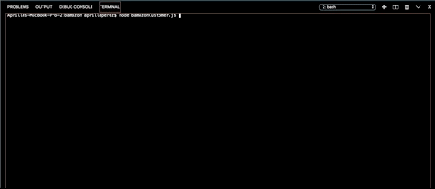

# Bamazon

## Overview
Bamazon is a simple MySQL application that lets a customer look through a table of products to "buy" from. The app displays the item's id, the product name, and its price to the user, and once the user makes a selection, the app then compares the requested amount of product from the user with the current quantity in stock from the database. The user will receive a confirmation or error message and will be prompted back to the start screen until they decide to exit.

## Languages
Javascript, Node.js, MySQL

## IMPORTANT
Included is the package.json with the dependencies: Inquirer and MySQL. Please "$ npm install" to successfully run the app, or make note to npm install inquirer and MySQL through the npm website. Additionally, please run createDB.sql to set up the appropriate database for the app.

## Demo

